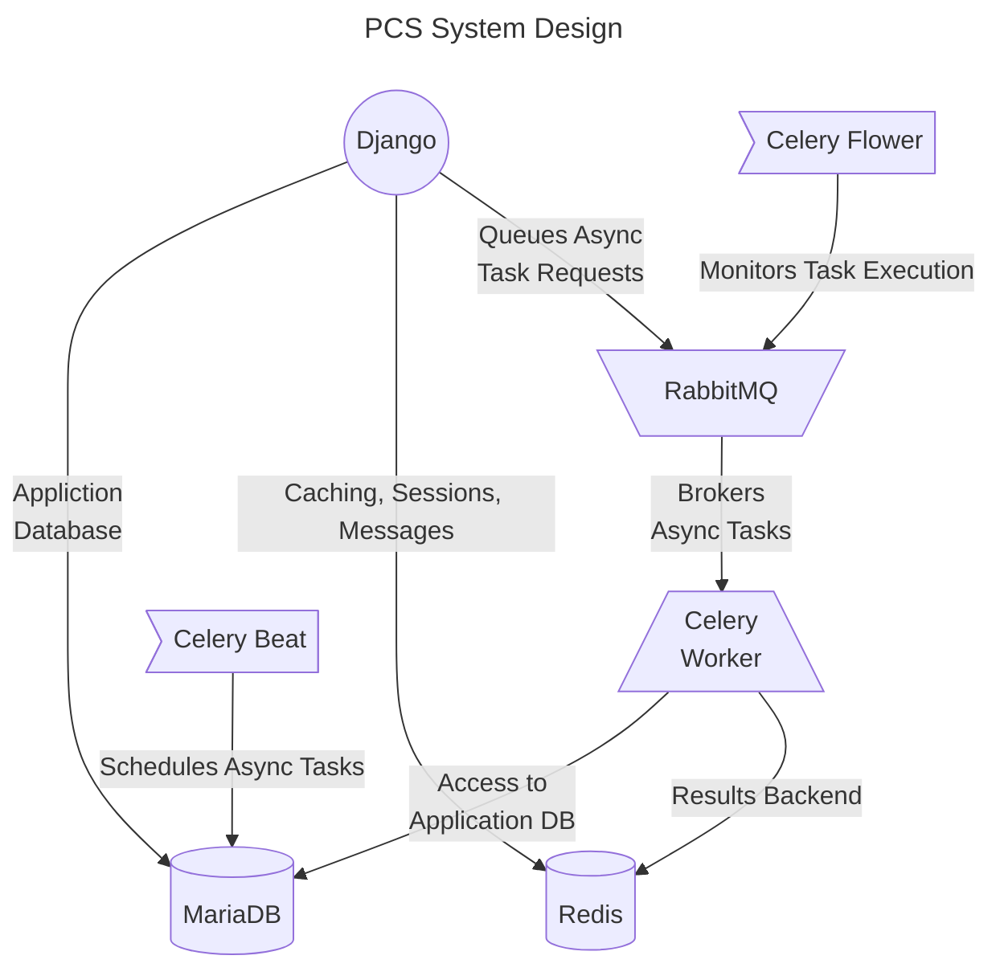

# Deployment

There are many ways to [deploy Django](https://docs.djangoproject.com/en/4.2/howto/deployment/). The articles in this section cover configuring the PCS, general deployment guidelines, and deploying both with and without Docker.

{: .important-title }
> Docker
>
> The project has been extenively tested with and includes files for deploying using [Docker](https://www.docker.com/). Please reference the project's [Docker documentation]({{ site.url }}/deployment/docker/) for usage information.

## Support Services

The project settings file[^1] specifies the use of several support services which run alongside the Django application server.

- **Celery**  
    Performs asynchronous task execution requested by Django
- **MariaDB**  
    Django's application database
- **Redis**  
    Object store for Django's cache, session and messaging systems & Celery results backend
- **RabbitMQ**  
    Message broker which brokers Celery tasks

[^1]: `Programming-Contest-Suite/src/contestsuite/settings.py`
