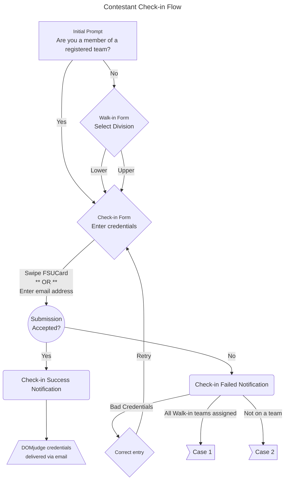

# Contestant Check-in

{: .highlight-title }
> Volunteer Check-in
>
> Volunteers should check into the contest using the [Volunteer Check-in]({{ site.url }}/usage/volunteers/volunteer_checkin.html) interface, NOT the Contestant Check-in interface.

The Contestant Check-in interface is used to perform contestant check-in on contest day, and consists of a simple form which refreshes after each user checks in. When logged in as a volunteer, a link to the interface is accessible from the user's dropdown menu located in site's navigation bar. The page may be accessed directly by navigating to `<site_url>/checkin/`.

## Managing Contestant Check-in

Contestant check-in is best managed by using several laptops as check-in stations. At each station, a volunteer will log in and navigate to the Contestant Check-in interface. The volunteer should then monitor the station as contestants use the laptop to complete the check-in process.

{: .important-title }
> Check-in Interface Access
>
> The Contestant Check-in interface is accessible *only* by contest volunteers.

### Swipe Check-in

Contestants have the option of completing the check-in process by swiping their FSUCard at a check-in station. Contestants who add the last 8 digits of their FSUCard number to the the `FSU Number` section of their account profile may utilize this check-in method.

To enable swipe check-in support at a check-in station, simply attach a USB swipe card reader to the station's computer. Many operating systems will automatically install the drivers required to recognize and operate the card reader as an input device.

## Check-in Process

The following diagram summarizes a contestant's interaction with the check-in interface.

### Case 1

In the event that a user attempts to check in as a Walk-in contestant and all Walk-in teams have been assigned, they will receive an error notification that no Walk-in teams are available. Unfortunately, additional walk-in teams cannot be created in this scenario. The contestant will need to find and join a registered team or an already assigned walk-in team with an open spot.

### Case 2

In the event a contestant selects 'Yes' at the registered teams prompt despite not being on a team and then provides a valid FSUCard swipe or email address entry, then they will receive a notification that they are not on a registered team. The contestant will either need to find and join a registered team with an open spot, or check in as a walk-in contestant.
