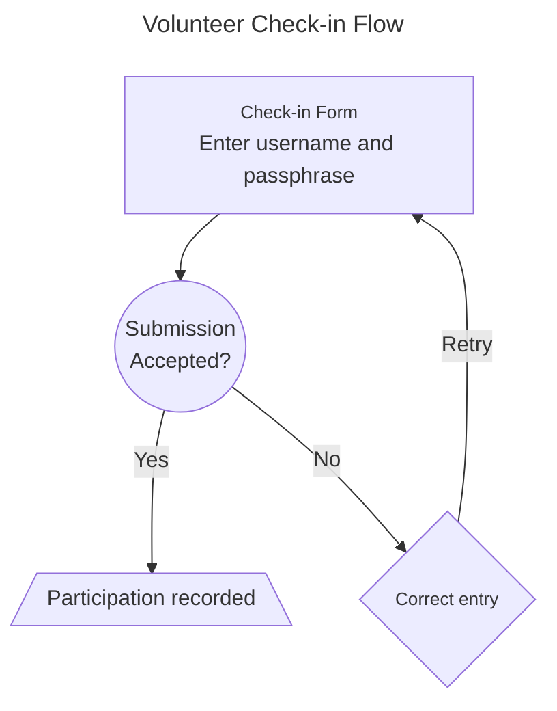

# Volunteer Check-in

The Volunteer Check-in interface is used to perform contest check-in by those who are Docents, Proctors, Question Writers, or Contest Organizers. The interface consists of a simple form which refreshes after each user checks in. When logged in as a volunteer, a link to the interface is accessible from the a user's dropdown menu located in site's navigation bar. The page may be accessed directly by navigating to `<site_url>/checkin/volunteer/`.

### Completing Check-in

On or after Contest Day, the Contest Organizers will provide each volunteer who fulfills the participation requirements with a passphase used to complete the check-in process. A volunteer must enter their username and the passphrase into the check-in form to successfuly record their participation.

